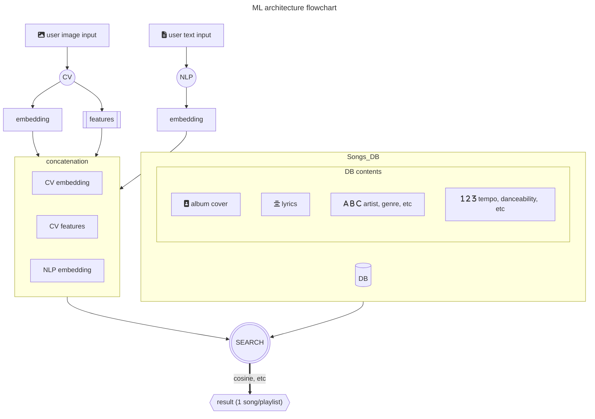

# ML Design Document Draft

# Дизайн ML системы - AI DJ

## 1. Цели и предпосылки

### 1.1. Обоснованность разработки продукта

**Бизнес-цель:**

- Автоматизация процесса сбора музыкального плейлиста для мероприятий или заведений с учетом анализа визуальных признаков и тескстовых запросов
- Повышение уровня удовлетворения посетителей, что улучшит отзывы и затем популярность заведения или мероприятия

**Польза от внедрения ML модели**

- Благодаря использованию машинного обучения можно будет учитывать в пользовательских запросах, такие признаки, как тип помещения, доминирующая цветовая гамма заведения, активности людей, дресс-код, которые позволяют удачнее и более обосновано подобрать музыку для помещения.

**Критерии успеха**

- В Яндекс картах, 15% отзывов баров и ресторанов упоминяют музыку, таким образом можем ставить критерию — получить 20% позитивные отзывы
- Экономия времени организаторов и администраторов, потраченное на сбор плейлистов с 30 минут до 1 минуты

### 1.2. Бизнес-требования и ограничения

**Бизнес-требования:**

- Для индивидуального пользователя сервиса – автоматизация подбора плей-листа в соответствии с его personality (настроение, музыкальный вкус, стиль)
- Для пользователя – организатора мероприятий/владельца общественных пространств – подбор плей-листа в соответствии с интерьером/цветовой гаммой помещения, текстовым описанием мероприятия/заведения, активностями/внешним видом (дресс-кодом) пользователей, посещающих мероприятия/заведения/общественные пространства, вследствие этого – повышение удовлетворенности этих людей сервисом. Примеры юзкейсов:
  - Пользователь — организатор мероприятия, при помощи этого сервиса может сгенерировать подходящий для него плейлист
  - Пользователь — владелец общественного пространства (кафе, торговый центр, коворкинг), при помощи сервиса может подобрать фоновую музыку
  - Пользователь — владелец общественного пространства (торговый центр, парк), устанавливает интерактивную развлекательную систему с сервисом, которая по внешнему виду посетителей индивидуально подбирает музыку для них

**Бизнес-ограничения:**

- Заказчик может накладывать различные критерии на допустимость песен в плейлистах: например, отсутствие ненормативной лексики, определенный жанр или язык
- Заказчик может предоставлять данные с камеры невысокого качества: например, если в торговом центре приложение используется с камерами наблюдения

**Что мы ожидаем от конкретной итерации:**

**Ожидания от конкретной итерации:**

- Разработка сервиса – рекомендательной системы, которая позволит подобрать плей-лист для мероприятия/заведения/общественного пространства, выбирая музыку из тестовой базой музыкальных произведений

**Описание бизнес-процесса пилота:**

- Пилот проекта может быть интегрирован в культурную программу различных мероприятий (например, университетских), на которых будет протестирован

**Возможные пути развития проекта**

- Для повышения точности рекомендаций можно обучить модель, которая поместит эмбеддинги песен и запросов пользователей в одно пространство. Референс: [LightFM](https://making.lyst.com/lightfm/docs/lightfm.html). Такую модель нужно итеративно дообучать с поступлением новых песен и запросов
- Базу данных нужно постоянно обновлять свежими песнями
- Для повышения точности рекомендаций можно добавить классификацию интерьера на фото
- Для повышения точности рекомендаций можно собирать обратную связь от пользователей (лайки, оценки и т.п.)
- Можно добавить функцию генерации короткого описания получившихся плейлистов с помощью LLM
- Для развития маркетинговой стратегии можно установить связи со стриминговыми площадками
- Для повышения привлекательности приложения для пользователей и увеличения проведенного в нем времени можно добавить социальные функции. Они могут включать возможность публиковать сгенерированные плейлисты, лайкать чужие и приводить в приложение друзей 

### 1.3. Что входит в скоуп проекта/итерации, что не входит

**На закрытие каких БТ подписываемся в данной итерации:**

- В данной итерации будет разработан MVP, который сможет подбирать плей-лист для мероприятия/заведения/общественного пространства

**Что не будет закрыто:**

- В данной итерации MVP не сможет подбирать плей-лист для конкретного пользователя

**Описание результата с точки зрения качества кода и воспроизводимости решения:**

- Код должен быть логичен и понятен, также должен осуществляться контроль версий кода и экспериментов для их воспроизводимости

**Описание планируемого технического долга:**

- Разработка подсистемы, позволяющей подбирать плей-лист для конкретного пользователя, опираясь на его стиль одежды, выражение лица, позу и так далее.
- Расширение базы музыкальных произведений, возможность создания подборок музыки для различных стран
- Каждый раз при добавлении новых песен в БД нужно пересчитывать ее индекс

### 1.4. Предпосылки решения

**Проблема.** Проанализировав отзывы о мероприятиях/заведениях, мы обнаружили, что отзывы могут ухудшаться из-за того, что музыка подобрана неправильно и/или она чересчур громкая, и пользователи склонны выбирать для следующего посещения другие заведения/мероприятия. Администрация заведения/мероприятия не всегда может выделить время для подбора плей-листа/деньги для найма диджея. Разрабатываемый сервис поможет закрыть потребность выбора подходящей музыки, и, как следствие, повысит удовлетворенность клиентов.

**Данные.** Так как данные предпочтений пользователей изначально недоступны, алгоритм нужно реализовывать в unsupervised режиме. Один из вариантов постановки задачи -- ранжирование объектов (песен).

**Тип инференса.** Онлайн по запросу пользователя выдается одна песня/плейлист.

## 2. Методология

### 2.1 Постановка задачи

- Ранжирование объектов с разнородными признаками по заданным критериям. Реализуется в виде поискового алгоритма с метрикой близости
  
### 2.2 Блок-схема решения

### 2.3 Этапы решения задачи

#### Этап 1 — подготовка данных

- найти базу данных песен, которая должна включать в себя:
    - базовые характеристики: исполнитель, год и т. п.
    - желательно обложка альбома
    - численные характеристики песни: энергичность, эмоциональность, музыкальный лад и т. п.
- нужен тестовый датасет с эталонными рекомендациями по запросу
- подготовить датасет изображений разного стиля одежды (в открытых источниках нет подходящих)
##### Описание собранной базы данных песен

Для формирования тестовой базы песен сервиса, реализовали web scraper для сайта [Tunebat.com](https://tunebat.com/).
У каждой песни определены следующие характеристики: 
- Key -- тональность музыкального произведения
- BPM -- темп песни 
- Popularity -- популярность определенная по прослушиваниям
- Energy -- энергичность, которая определяется тем насколько интенсивен и активен трек, в зависимости тембра, воспринимаемой громкости
- Danceability -- насколько трек подходит для танцев, исходя из общей регулярности, силы ударов, стабильности ритма и темпа
- Happiness -- жизнерадостность и позитивность трека
- Acousticness -- насколько вероятно, что трек акустический
- Instrumentalness -- насколько вероятно, что трек инструментальный
- Liveness -- насколько вероятно, что трек был записан вживую
- Speechiness -- несколько явно слова изобразятся в песне 
- Loudness -- средняя амплитуда в децибелах по всей трассе в пределах от -60дБ до Odb.

###### Пример собранных данных

| artist | title | key | BPM | Camelot | Popularity | energy | danceability | happiness | accousticness | instrumentalness | liveness | speechiness | loudness |
| --- | --- | --- | --- | --- | --- | --- | --- | --- | --- | --- | --- | --- | --- |
| Rihanna | S&M | C# Major | 128 | 3B | 83 | 68 | 77 | 84 | 1 | 0 | 9 | 4 | 4 |
| Pitbull | Hotel Room Service | C# Major | 126 | 3B | 75 | 63 | 85 | 74 | 1 | 0 | 7 | 23 | 23 |
| Gunna | fukumean | C# Minor | 130 | 12A | 95 | 62 | 85 | 22 | 12 | 0 | 28 | 9 | 9 |
| Metallica | Fuel | C# Major | 107 | 3B | 72 | 95 | 49 | 59 | 0 | 0 | 3 | 5 | 5 |

##### Описание собранного датасета одежды
В полном датасете содержатся 3 тысячи изображений людей в разных ракурсах, позах, местностях, каждый из которых одет в одежду определенного стиля (повседневный, формальный или спортивный-3 класса). Каждый стиль представлен 1 тысячью изображений (500 мужчин и 500 женщин). Также представлены алгоритмы предобработки собранных данных, а также полученные csv-файлы для деления датасета на наборы данных для обучения, валидации и тестирования нейронной сети.

#### Этап 2 — подготовка моделей

- CV embedder
  - Классификация стиля одежды присутствующих людей
    - детекция людей с помощью предобученной модели
    - подсчет людей в одежде каждого типа с вынесением вердикта о характере мероприятия (спортивное, формальное, неформальное)
    - ML-метрика: Accuracy, так как датасет содержат 3 класса с равным количеством сэмплов, то есть является абсолютно сбалансированным
- NLP embedder
  - модель должна поддерживать ввод на разных языках
  - модель должна помещаться на стандартную GPU (≈8 ГБ видеопамяти)

#### Этап 3 — создание индекса БД песен и алгоритма поиска

- Желательно использовать быстрый индекс
- Точность алгоритма поиска должна оцениваться по метрике precision at K на тестовом датасете

#### Этап 4 — сбор обратной связи про пилот

## 3. Подготовка пилота

### 3.1. Способ оценки пилота

Для оценки успешности пилота проведем AB-тестирование в потенциальных заведениях -- заказчиках приложения.
Например, в эксперименте могут участвовать две кофейни.
В кофейню A внедряем наше приложение, а в контрольной кофейне B оставляем все как есть.
Желательно сделать это в момент, когда кофейни меняют плейлист, например, в начале недели.

В конце экспериментального периода (около недели) сравниваем метрики в кофейнях A и B.
Основная метрика -- агрегированная удовлетворенность клиентов сервисом в кофейне, на которую влияет качество музыки.
Для подсчета можно использовать отзывы на интернет-площадках за выбранный период, а также те способы оценки, что уже используются в кофейнях.
Также при возможности считаем вторичную метрику -- время, которое администраторы кофеен потратили на подбор плейлиста.

### 3.2. Что считаем успешным пилотом

Успешным пилот считается, если мы наблюдаем статистически значимую разницу между метриками кофеен A и B.
Удовлетворенность клиентов в кофейне A должна быть выше, чем в контрольной кофейне B, а время, которое администраторы потратили на подбор плейлиста -- ниже.
Точные численные критерии будут подобраны позднее.

## 4. Внедрение

### 4.1. Архитектура решения

#### Описание общей архитектуры


- **Интерфейс пользователя**: Веб-приложение или мобильное приложение на React.js, через которое пользователи могут настраивать параметры мероприятия. Приложение обращается к API системы по HTTP.
- **Сервис анализа данных**: Модуль, ответственный за анализ параметров мероприятия и создание музыкальных плейлистов с использованием ML-модели.
- **База данных**: Хранение данных о музыкальных треках
- **Сервис поиска**: Сервис поиска песен на основе ML, который выдает релевантные песни по визуальному и текстовому запросу пользователя. Компоненты:
    - FAISS index
    - CV embedder: модель, выдающая эмбеддинги визуальной составляющей
    - NLP embedder: модель, выдающая эмбеддинги текстовой составляющей
        - LEALLA encoder    

#### Блок-схема ML архитектуры



### 4.2. Описание инфраструктуры и масштабируемости

Для обучения и развертывания ML-модели можно использовать облачные ресурсы, такие как Amazon Web Services (AWS) или Google Cloud Platform (GCP). Эти облачные платформы предоставляют масштабируемые вычислительные мощности и инструменты для машинного обучения.

- Для обучения NLP embedder не требуется инфраструктура, так как используется предобученная модель. Для инференса достаточно GPU c <8 GB видеопамяти.
- Быстрее всего нужно будет масштабировать базу данных для возможности быстрого пополнения новыми песнями
- Пиковая нагрузка ожидается во время высокой посещаемости заведений: обед, ужин, вечеринка (ночь)

### **4.3. Требования к работе системы**

- **SLA**: Согласование с заказчиками на уровне доступности системы и времени отклика.
- **Пропускная способность**: Система должна обеспечивать достаточную пропускную способность для обработки запросов от множества пользователей одновременно.
- **Задержка**: Время отклика системы должно быть минимальным, чтобы обеспечить удовлетворительный пользовательский опыт.

### 4.4. Безопасность системы

**Потенциальная уязвимость системы:**

- Потенциальные уязвимости могут включать в себя нарушения безопасности данных, атаки на серверы, утечку конфиденциальной информации. Для защиты системы необходимо внедрить меры безопасности, такие как аутентификация пользователей, шифрование данных и мониторинг безопасности.

### 4.5. Безопасность данных

Законодательство России, особенно Федеральный закон "О персональных данных" № 152-ФЗ, устанавливает ряд требований для обработки и обеспечения хранения пользовательских данных. Ниже приведены основные требования, которые предъявляются к операторам данных:

**Согласие на обработку данных**: Операторы данных обязаны получить согласие от субъектов данных (пользователей) на сбор и обработку их персональных данных. Согласие должно быть добровольным и информированным, и оно может быть выражено в письменной или иной форме.

**Законная обработка**: Обработка персональных данных должна быть совершена в соответствии с законом и целями, для которых данные были собраны.

**Защита данных**: Операторы данных обязаны принимать меры по обеспечению безопасности персональных данных и предотвращению их утраты, кражи или незаконного доступа. Это включает в себя меры технической и организационной безопасности, такие как шифрование данных, антивирусные системы и т. д.

**Сроки хранения данных**: Закон устанавливает сроки хранения персональных данных и требования к их обезличиванию. Сохранение данных должно быть ограничено временем, необходимым для достижения целей обработки.

**Права субъектов данных**: Лица, чьи данные обрабатываются, имеют право на доступ к своим данным, их коррекцию и удаление. Они также могут обжаловать незаконную обработку своих данных.

**Уведомление о персональных данных**: Операторы данных должны уведомлять Роскомнадзор (Федеральную службу по надзору в сфере связи, информационных технологий и массовых коммуникаций) о своей деятельности по обработке данных.

**Передача данных за границу**: Закон устанавливает правила для передачи персональных данных за пределы России, включая обязательные соглашения и согласование с Роскомнадзором.

**Административные и уголовные наказания**: Закон предусматривает административные и уголовные наказания за нарушение правил обработки и хранения персональных данных.

Операторы данных также должны уделять внимание масштабируемости и безопасности системы хранения данных, чтобы предотвратить утечки и несанкционированный доступ к информации. Персональные данные должны обрабатываться с особой осторожностью, чтобы обеспечить их конфиденциальность и целостность в соответствии с требованиями закона.

---

# ЗАМЕТКИ

## Финансы

- цена сервиса должна быть ниже, чем цена за выступление диджея

## Закон

- не сохраняем фотографии, поэтому не нарушаем ФЗ о персональных данных

## Система проектирования для FrontEnd AIDj
## Визуальная сторона сайта

## Страница с формой

### Цветовая схема для FrontEnd
- **Primary Color:** Blue (#007bff)
- **Secondary Color:** White (#ffffff)
- **Accent Color:** Black (#000000)

### Типография сайта
#### Типография сайта
- **Font Family:** Arial, sans-serif
- **Font Size (H1):** 32px 
- **Font Size (H2):** 24px 

#### Пункты и основной текст
- **Font Family:** Arial, sans-serif 
- **Font Size:** 16px 

### кнопках 
- **Background Color:** Blue (#007bff) 
- **Text Color:** White (#ffffff)

## Описание интерфейса: 
### Страница формы
* Интерфейс веб-страницы имеет светло-синий заголовок, содержащий чёрный текст. Основной текст в заголовке читает "Лучший диджей - AIDj. Опишите свое событие и загрузите его изображение" жирными черными буквами.
* Под заголовком есть поле для комментариев и опция для загрузки изображений. В ней есть значки, указывающие, что изображения можно перетаскивать в эту область. Существуют ограничения формата файлов (SVG, PNG, JPG или GIF) с максимальным размером файла 800x400px для загрузки. 
* В нижней части изображения есть еще один меньший логотип "AIDj", за которым следуют ссылки на нижние колонтитулы, включая О, политику конфиденциальности, лицензирование и контакт. Фон веб-страницы белый.

```
## Лучший DJ - это AIDj
## Опишите свое мероприятие и загрузите его фотографию

- Введите свой комментарий в поле ввода ниже
- Загрузите изображение, перетащив его в эту область или выбрав его из файлов
- Допустимые форматы изображений: SVG, PNG, JPG или GIF
- Максимальный размер изображения: 800x400 пикселей

!Логотип AIDj

О нас | Политика конфиденциальности | Лицензирование | Контакты
```
## Страница Список музыкальных произведений
Список песен различных исполнителей с указанием их соответствующих сроков. Изображение отображает цифровой интерфейс, вероятно, с музыкального приложения или веб-сайта. Фон белый, а текст и иконки в основном черные и фиолетовые. 
В левом верхнем углу иконка с надписью "Все ди-джеи". Под этим заголовком расположены десять записей, каждая из которых состоит из имени исполнителя (Исполнитель от 1 до Исполнитель 10), названия песни (Музыка от 1 до Музыка 10) и длительности песни.
Каждая запись имеет значок на левой стороне; эти иконки все идентичны и фиолетовый цвет.

## Aрхитектура сайта

- **src/**
  - Это исходная папка, содержащая все основные файлы кода для приложения.
    - **shared/**
      - Папка для компонентов, которые используются в разных частях приложения.
        - `Footer.js`: Содержит код для отображения нижнего колонтитула приложения.
        - `Layout.js`: Содержит код, связанный с общей компоновкой или структурой пользовательского интерфейса.
        - `Navbar.js`: Содержит код для отображения панели навигации.
    - `App.js`: Основной компонент, который оборачивает все другие компоненты, обычно содержит логику маршрутизации.
    - `Form.js`: Вероятно, содержит код, связанный с элементом формы или обработкой формы в приложении.
    - `MusicList.js`: Вероятно, содержит код для отображения списка музыкальных элементов или похожего контента.
    - `Test.js`: Может использоваться для целей тестирования, может содержать тестовые случаи или тестовые компоненты.
    - `index.css`: Основной файл CSS, который, вероятно, содержит глобальные стили для этого приложения.
    - `index.js`: Файл точки входа, который отображает компонент App в DOM, обычно где вызывается ReactDOM.render().

- `.gitignore`
  - Файл, содержащий список файлов и каталогов, которые игнорируются при отправке в git-репозиторий.

- `README.md`
  - Файл Markdown, содержащий информацию об этом проекте, включая инструкции по настройке, использованию и т.д.

## Connecting with the service to receive songs file Test.js.

Импортируем компонент Link из библиотеки react-router-dom, который позволяет создавать ссылки для навигации по приложению

Импортируем хук useState из библиотеки react, который позволяет использовать состояние в функциональных компонентах

Импортируем библиотеку axios, которая позволяет делать HTTP-запросы к серверу

Импортируем константу SONG_LIST_URL из файла index.js, которая содержит адрес сервера, откуда получаем список песен

Создаем функциональный компонент ListItem, который принимает в качестве пропсов название, исполнителя и популярность песни
```
function ListItem({title, artist, popularity})
```
Создаем функциональный компонент Test, который отображает список всех песен, полученных с сервера
```
function Test() {
* Используем хук useState, чтобы создать переменную состояния songs и функцию для ее обновления setSongs
* Изначально songs равен пустому массиву
* Используем библиотеку axios, чтобы сделать GET-запрос к серверу по адресу SONG_LIST_URL
* Когда получаем ответ, вызываем функцию setSongs, чтобы обновить состояние songs данными из ответа
* Возвращаем JSX-разметку, которая отображает список песен в виде неупорядоченного списка с классами Tailwind CSS для стилизации
}
```


- Экспортируем компонент ListItem по умолчанию, чтобы использовать его в других файлах
- Экспортируем компонент Test по умолчанию, чтобы использовать его в других файлах

