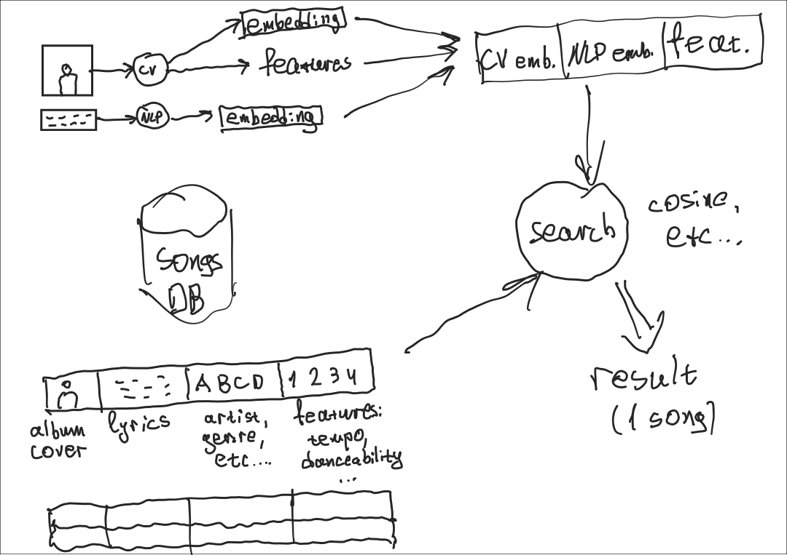

# ML Design Document Draft

# Дизайн ML системы - AI DJ

## 1. Цели и предпосылки

### 1.1. Обоснованность разработки продукта

**Бизнес-цель:**

- Автоматизация процесса сбора музыкального плейлиста для мероприятий или заведений с учетом анализа визуальных признаков
- Повышение уровня удовлетворения посетителей, что улучшит отзывы и затем популярность заведения или мероприятия

**Польза от внедрения ML модели**

- Благодаря использованию машинного обучения можно будет учитывать в пользовательских запросах, такие признаки, как тип помещения, доминирующая цветовая гамма заведения, активности людей, дресс-код, которые определяют свойства подходящей музыки.

**Критерии успеха**

- Положительный отзыв на музыку и/или общую атмосферу
- Экономия времени организаторов и администраторов, потраченное на сбор плейлистов
- *Тут умные циферки будут*

### 1.2. Бизнес-требования и ограничения

**Бизнес-требования:**

- Для индивидуального пользователя сервиса – автоматизация подбора плей-листа в соответствии с его personality (настроение, музыкальный вкус, стиль)
- Для пользователя – организатора мероприятий/владельца общественных пространств – подбор плей-листа в соответствии с интерьером/цветовой гаммой помещения, текстовым описанием мероприятия/заведения, активностями/внешним видом (дресс-кодом) пользователей, посещающих мероприятия/заведения/общественные пространства, вследствии этого-повышение удовлетворенности этих людей сервисом

**Бизнес-ограничения:**

- Возможная неготовность пользователей автоматизировать подбор плей-листа
- Возможность подбора плей-листа, не удовлетворяющего потребностям пользователей

**Что мы ожидаем от конкретной итерации:**

**Ожидания от конкретной итерации:**

- Разработка сервиса – рекомендательной системы, которая позволит подобрать плей-лист для мероприятия/заведения/общественного пространства, выбирая музыку из тестовой базой музыкальных произведений

**Описание бизнес-процесса пилота:**

- Пилот проекта может быть интегрирован в культурную программу различных мероприятий (например, университетских), на которых будет протестирован

### 1.3. Что входит в скоуп проекта/итерации, что не входит

**На закрытие каких БТ подписываемся в данной итерации:**

- В данной итерации будет разработан MVP, который сможет подбирать плей-лист для мероприятия/заведения/общественного пространства

**Что не будет закрыто:**

- В данной итерации MVP не сможет подбирать плей-лист для конкретного пользователя

**Описание результата с точки зрения качества кода и воспроизводимости решения:**

- Код должен быть логичен и понятен, также должен осуществляться контроль версий кода и экспериментов для их воспроизводимости

**Описание планируемого технического долга:**

- Разработка подсистемы, позволяющей подбирать плей-лист для конкретного пользователя, опираясь на его стиль одежды, выражение лица, позу и так далее.
- Расширение базы музыкальных произведений, возможность создания подборок музыки для различных стран
- Каждый раз при добавлении новых песен в БД нужно пересчитывать ее индекс

### 1.4. Предпосылки решения

Проанализировав отзывы о мероприятиях/заведениях, мы обнаружили, что отзывы могут ухудшаться из-за того, что музыка подобрана неправильно и/или она чересчур громкая, и пользователи склонны выбирать для следующего посещения другие заведения/мероприятия. Администрация заведения/мероприятия не всегда может выделить время для подбора плей-листа/деньги для найма диджея. Разрабатываемый сервис поможет закрыть потребность выбора подходящей музыки, и, как следствие, повысит удовлетворенность клиентов.

## 2. Методология

### 2.1 Постановка задачи

- Поиск самой подходящей песни из заданной базы данных. Реализуется в виде поискового алгоритма с метрикой близости

### 2.2 Блок-схема решения

### 2.3 Этапы решения задачи

- Этап 1 — подготовка данных
    - найти базу данных песен
        - желательно с обложками
    - нужен тестовый датасет
- Этап 2 — подготовка моделей
    - CV embedder
    - NLP embedder
- Этап 3 — создание индекса БД песен
- Этап N — сбор обратной связи про пилот

## 4. Внедрение

### 4.1. Архитектура решения:

**Блок-схема и пояснения:**

- **Интерфейс пользователя**: Веб-приложение или мобильное приложение, через которое пользователи могут настраивать параметры мероприятия.
- **Сервис анализа данных**: Модуль, ответственный за анализ параметров мероприятия и создание музыкальных плейлистов с использованием ML-модели.
- **База данных**: Хранение данных о музыкальных треках, предпочтениях пользователей, а также параметрах мероприятий.
- **ML-модель**: Модель машинного обучения, которая прогнозирует подходящие треки и создает плейлисты на основе входных данных.
    - CV embedder: модель, выдающая эмбеддинги визуальной составляющей
    - NLP embedder: модель, выдающая эмбеддинги текстовой составляющей

### 4.2. Описание инфраструктуры и масштабируемости

- выбрана архитектура поиска в условиях отсутствия датасета с предпочтениями пользователей
    - Для обучения и развертывания ML-модели можно использовать облачные ресурсы, такие как Amazon Web Services (AWS) или Google Cloud Platform (GCP). Эти облачные платформы предоставляют масштабируемые вычислительные мощности и инструменты для машинного обучения.
- плюсы выбранной архитектуры:
    - не требуется датасет с пользователями
- минусы выбранной архитектуры:
    - (пока) позволяет найти только одну песню
- Почему финальный выбор лучше других альтернатив: нету датасета!

### **4.3. Требования к работе системы**

- **SLA**: Согласование с заказчиками на уровне доступности системы и времени отклика.
- **Пропускная способность**: Система должна обеспечивать достаточную пропускную способность для обработки запросов от множества пользователей одновременно.
- **Задержка**: Время отклика системы должно быть минимальным, чтобы обеспечить удовлетворительный пользовательский опыт.

### 4.4. Безопасность системы

**Потенциальная уязвимость системы:**

- Потенциальные уязвимости могут включать в себя нарушения безопасности данных, атаки на серверы, утечку конфиденциальной информации. Для защиты системы необходимо внедрить меры безопасности, такие как аутентификация пользователей, шифрование данных и мониторинг безопасности.

### 4.5. Безопасность данных

Законодательство России, особенно Федеральный закон "О персональных данных" № 152-ФЗ, устанавливает ряд требований для обработки и обеспечения хранения пользовательских данных. Ниже приведены основные требования, которые предъявляются к операторам данных:

**Согласие на обработку данных**: Операторы данных обязаны получить согласие от субъектов данных (пользователей) на сбор и обработку их персональных данных. Согласие должно быть добровольным и информированным, и оно может быть выражено в письменной или иной форме.

**Законная обработка**: Обработка персональных данных должна быть совершена в соответствии с законом и целями, для которых данные были собраны.

**Защита данных**: Операторы данных обязаны принимать меры по обеспечению безопасности персональных данных и предотвращению их утраты, кражи или незаконного доступа. Это включает в себя меры технической и организационной безопасности, такие как шифрование данных, антивирусные системы и т. д.

**Сроки хранения данных**: Закон устанавливает сроки хранения персональных данных и требования к их обезличиванию. Сохранение данных должно быть ограничено временем, необходимым для достижения целей обработки.

**Права субъектов данных**: Лица, чьи данные обрабатываются, имеют право на доступ к своим данным, их коррекцию и удаление. Они также могут обжаловать незаконную обработку своих данных.

**Уведомление о персональных данных**: Операторы данных должны уведомлять Роскомнадзор (Федеральную службу по надзору в сфере связи, информационных технологий и массовых коммуникаций) о своей деятельности по обработке данных.

**Передача данных за границу**: Закон устанавливает правила для передачи персональных данных за пределы России, включая обязательные соглашения и согласование с Роскомнадзором.

**Административные и уголовные наказания**: Закон предусматривает административные и уголовные наказания за нарушение правил обработки и хранения персональных данных.

Операторы данных также должны уделять внимание масштабируемости и безопасности системы хранения данных, чтобы предотвратить утечки и несанкционированный доступ к информации. Персональные данные должны обрабатываться с особой осторожностью, чтобы обеспечить их конфиденциальность и целостность в соответствии с требованиями закона.

---

# ЗАМЕТКИ

## Финансы

- цена сервиса должна быть ниже, чем цена за выступление диджея

## Закон

- не сохраняем фотографии, поэтому не нарушаем ФЗ о персональных данных
