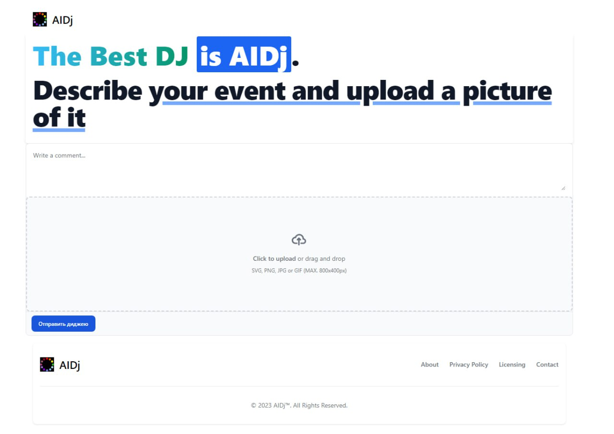
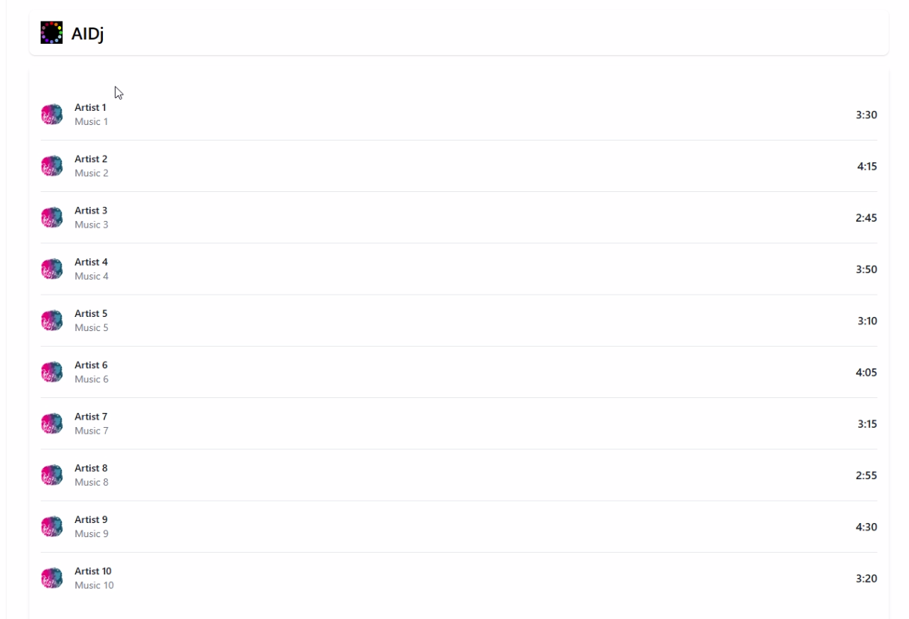

# AI-DJ

AI-Сервис генерации плейлистов музыки на основании изображений и описаний мероприятий или заведений

## Примеры юзкейсов

- Пользователь — организатор мероприятия, при помощи этого сервиса может сгенерировать подходящий для него плейлист
- Пользователь — владелец общественного пространства (кафе, торговый центр, коворкинг), при помощи сервиса может подобрать фоновую музыку
- Пользователь — владелец общественного пространства (торговый центр, парк), устанавливает интерактивную развлекательную систему с сервисом, которая по внешнему виду посетителей индивидуально подбирает музыку для них

# Feature engineering

Сервис должен извлечить множество признаков из целевого изображения, которые будут использованы для рекомендации музыки. 

### Цветовая гамма

Исследования показали, что люди ([синестеты и несинестеты](https://ru.wikipedia.org/wiki/%D0%A1%D0%B8%D0%BD%D0%B5%D1%81%D1%82%D0%B5%D0%B7%D0%B8%D1%8F)) ассоциируют звуки с цветами, и это скорее проиходит в подсознании. Музыкант Александр Скрябин разработал sound-to-color circle of fifths, где присвоин цвет к каждой тональности в круге квинт.

Scriabin's sound-to-color 

### Активности людей на фотографии

Было выбрано несколько датасетов, для задачи детекции и классификации активностей людей (сидеть, гулять, говорить, танцевать…), то что влияет на жанр, темп, настроение, и присутствие вокала в музыке

- MPII Human Pose Dataset — http://human-pose.mpi-inf.mpg.de/#overview
- ****Human Action Recognition (HAR) Dataset —**** https://www.kaggle.com/datasets/meetnagadia/human-action-recognition-har-dataset
### To be continued…

# 🆕 База музыки

Для формирования тестовой базы песен сервиса, реализовали web scraper для сайта [Tunebat.com](https://tunebat.com/).
У каждой песни определены следующие характеристики: 
- Key -- тональность музыкального произведения
- BPM -- темп песни 
- Popularity -- популярность определенная по прослушиваниям
- Energy -- энергичность, которая определяется тем насколько интенсивен и активен трек, в зависимости тембра, воспринимаемой громкости
- Danceability -- насколько трек подходит для танцев, исходя из общей регулярности, силы ударов, стабильности ритма и темпа
- Happiness -- жизнерадостность и позитивность трека
- Acousticness -- насколько вероятно, что трек акустический
- Instrumentalness -- насколько вероятно, что трек инструментальный
- Liveness -- насколько вероятно, что трек был записан вживую
- Speechiness -- несколько явно слова изобразятся в песне 
- Loudness -- средняя амплитуда в децибелах по всей трассе в пределах от -60дБ до Odb.

### Пример собранных данных

| artist | title | key | BPM | Camelot | Popularity | energy | danceability | happiness | accousticness | instrumentalness | liveness | speechiness | loudness |
| --- | --- | --- | --- | --- | --- | --- | --- | --- | --- | --- | --- | --- | --- |
| Rihanna | S&M | C# Major | 128 | 3B | 83 | 68 | 77 | 84 | 1 | 0 | 9 | 4 | 4 |
| Pitbull | Hotel Room Service | C# Major | 126 | 3B | 75 | 63 | 85 | 74 | 1 | 0 | 7 | 23 | 23 |
| Gunna | fukumean | C# Minor | 130 | 12A | 95 | 62 | 85 | 22 | 12 | 0 | 28 | 9 | 9 |
| Metallica | Fuel | C# Major | 107 | 3B | 72 | 95 | 49 | 59 | 0 | 0 | 3 | 5 | 5 |
# Реализация сервиса

Сервис представлляет собой веб-приложение с простым графическим интерфейсом, с помощью которого пользователь может сделать фотографию или загрузить файл, для генерации плейлиста подходящиего для целевого мероприятия. 

## Веб-приложение

Для пользоватильского взаимодействия, разрабатывается [приложение](https://github.com/MulhamShaheen/AI-DJ/tree/frontend) на React.js которое будет по HTTP обращаться к API системы.

# Эксперименты

## Поиск песен по запросу

[Прототип поиска по текстам песен](https://colab.research.google.com/drive/1-H0D_RljalRm_CjWGgyferDdBFaxziv_?usp=sharing)

## Классификации активностей людей

[Обучение ResNet](https://colab.research.google.com/drive/1qkxuD9yYbE-79tDIxeQM3vBVfsIxdtXz?usp=sharing)

# Демо

## Главная страница

## Пример результатов 

